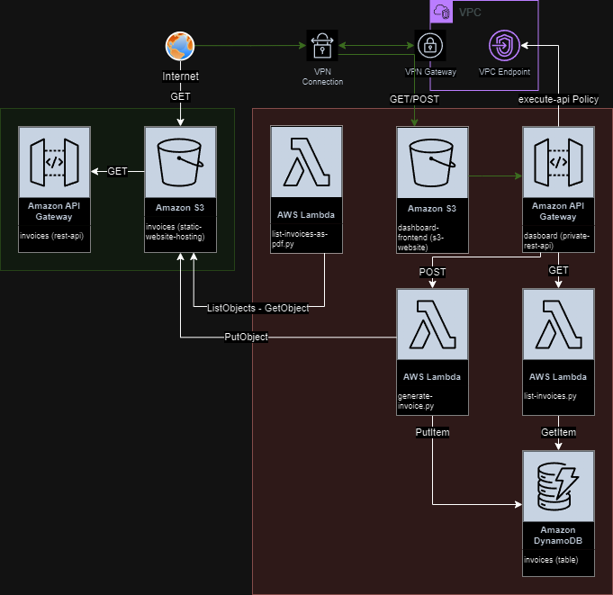

# accountant-terragrount
This IaaC project is written according to the planned infrastructure architecture of **accountant** application for automation using **terraform** and **terragrunt**.

### Planned Infrastructure Architecture


### Description of Infrastructure Architecture
Two different layers are considered in this architecture.

### 1. Dashboard  

The Dashboard layer is for employees only. In order for employees to enter data into the application, the lambda function (generate-invoice) triggered by a POST request will have the necessary permissions to convert the input it receives into PDF, write it to S3, and write it to the DynamoDB table.
At the same time, the lambda function (list-invoices) triggered by the GET request will have the necessary permissions to display the historical data written to DynamoDB.

A Private Rest API Gateway resource will be created to meet all these requests.
Requests to this resource can only be made from the VPC to be created and the VPC endpoint within the VPC.  
_(VPN installation may be required for user-friendly use such as fronend app.)_

At the same time, a bucket dashboard with Static Web Hosting Feature will be created to upload the output of the frontend application (React, Flutter, JS etc.).  
This layer is isolated from the 2nd layer (Invoices). It only has the authority to write to the accountant-invoices bucket created in the 2nd layer.  
  
### 2. Invoices
This layer was created to write the PDFs generated in the Dashboard layer to a public bucket and download these PDFs.  
  
An API Gateway, Lambda, IAM and Policies will be created.  
  
#### Resources:
1. Dashboard  
_**1.1.** VPC  
**1.2.** VPC Endpoint  
**1.3.** DynamoDB Table  
**1.4.** Lambda Function (list-invoices) and IAM Role with Policies  
**1.5.** Lambda Function (generate-invoice) and IAM Role with Policies  
**1.6.** API Gateway (Private - RestAPI) and Resource Policy
**1.7.** S3 Bucket (Static Web Site Hosting) with IP Restriction_  
2. Invoices  
_**1.1.** Lambda Function (list-invoices-as-pdf) and IAM Role with Policies  
**1.6.** API Gateway (RestAPI) and Resource Policy  
**1.7.** S3 Bucket (Static Web Site Hosting)_
  
## Pre-dependencies
This project was built with the following features.  
1)  $ terraform-version
    >Terraform v1.7.1 on windows_amd64
  
2) Terraform aws module
    ```
    aws = {
        source  = "hashicorp/aws"
        version = "~> 5.34.0"
    }
    ```
  
3) $ terragrunt --version
    >terragrunt version v0.54.21


## How to deploy
First, go to the directory of the environment you want to deploy.  
Example:
```
cd environtments/dev
```

Then run the `apply` command of terragrunt:
```
terragrunt apply
```